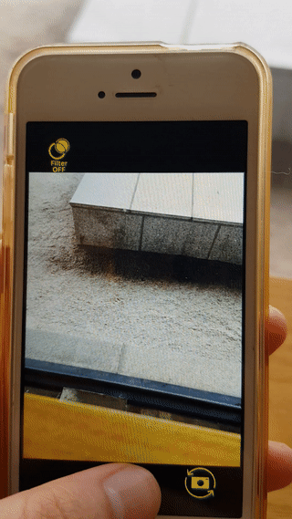
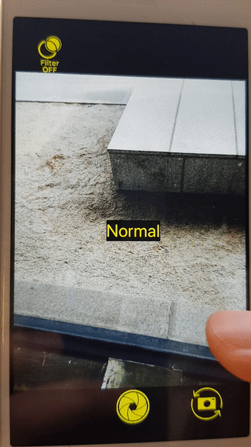

# AVCamfilter(apple example project) 와 Cocoapods 'PixelEditor', 'PixelEngine'활용한 카메라 필터/에디터 앱

Camera filter/ Editor demo app with AVCamfilter(apple example project), Cocoapods 'PixelEditor', 'PixelEngine'

  


### Prerequisites

For pods to work,

* Swift 4.2 (Xcode10+)
* iOS 10+

also install [CocoaPods](https://cocoapods.org)

## 카메라 

It is under CameraVeiwController.swift
For Camera, only minial changes for segue was made. Unnecessary codes for this project remain undeleted. 

CameraViewController 에 작성. 현재 애플 소스코드의 필요없는 부분이 많이 섞여있음. 기본적인 카메라 기능과 전면/후면 전환, 필터 적용 기능이 있음. 메인 스토리보드의 나머지 버튼은 앱을 실행했을 때 나타나지 않아서 그대로 놔둠. 

## 필터

실제로 필요한 부분은 RosyICRenderer.swift 소스코드에서는 Rosyfilter 하나만을 위한 Renderer 였으나 필터이름 array를 추가하여 슬라이드로 필터 전환이 가능하게 함. 

```swift
static let filterNameArray: [String] = ["CIPhotoEffectProcess", "CIPhotoEffectInstant",
"Normal", "CIPhotoEffectMono", "CIPhotoEffectNoir", 
"CIPhotoEffectTonal", "CIPhotoEffectFade", "CIPhotoEffectChrome",
"CIPhotoEffectTransfer"].sorted(by: >)
    
 static func numberOfFilterType() -> Int {
     return filterNameArray.count}
 ```


TODO// ICfilter 중 ICPhotofilter 를 적용하면 camerapreview에도 적용될 줄 알았으나 사진에만 적용되는 필터여서 ICColorMatrix 필터를 적용, 메트릭스를 조작하여 필터를 작성 후 바꿔야 할 것으로 보임 


Red filter example from the source code:

```swift
        rosyFilter = CIFilter(name: "CIColorMatrix")
        rosyFilter!.setValue(CIVector(x: 0, y: 0, z: 0, w: 0), forKey: "inputGVector")
```


## PhtoEditor


Cocoapods라이브러리를 활용하여 PreViewViewController.swift 작성. 
Constraints not set, the buttons are unstable.
라이브러리가 업데이트가 된건지, configuration 파일의 충돌로 pods 폴더 내 파일의 문제가 있는 건지 예시코드가 오류가 나는 부분이 많았고 (특히 Pods/PhotoEngine/ImageSource.swift) 오류 해결 후 실행이 되나 필터 collectionview에서 normal필터 외의 다른 필터가 나타나지 않음. 


## License
License information available under each LICENSE folders ( Pods/LICENSE)

original sources:

https://github.com/muukii/Pixel
https://developer.apple.com/documentation/avfoundation/cameras_and_media_capture/avcamfilter_applying_filters_to_a_capture_stream
